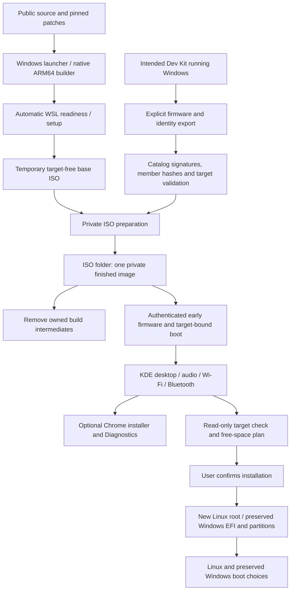

# Project map

There is one preparation workflow. Source and the reusable base are public;
target exports and prepared images are private.

The public base intentionally stops before hardware startup if it has not been
prepared. No Windows volume scan or firmware-cache reboot is part of Linux boot.

The root is the only public source tree. The one end-user guide is
[SETUP.md](../SETUP.md). The only normal build output is the finished private
image in the ignored `ISO/` folder. Source mirrors, generic bases, target exports
and manifests are temporary build data, removed by the managed run. There is no
separate Data folder or old-build history. Explicit transfer exports remain
user-owned; they are never discovered as implicit inputs.

| Component | Main source |
| --- | --- |
| Windows launcher, WSL, target export | `Start-DevKit2023CustomLinux.cmd`, `windows/` |
| Pinned kernel and patch hashes | `scripts/lib/common.sh`, `scripts/build-kernel.sh`, `config/kernel/`, `patches/` |
| Debian/KDE base and ARM64 ISO | `scripts/build-rootfs.sh`, `scripts/build-iso.sh` |
| Shared desktop, drivers and branding | `overlay/` |
| Target-bound runtime and early loading | `profiles/prepared/overlay/` |
| Authenticated private preparation | `scripts/prepare-iso.py`, shared catalog validator |
| Source/base/prepared verification | `scripts/check-source.py`, `scripts/verify-base.py`, `scripts/verify-prepared-iso.py`, `tests/` |
| Free-space installation and target handoff | `overlay/etc/calamares/`, `install_policy.py`, `devkit2023customlinux-install-storage`, prepared install-preflight |
| User support | [Diagnostics](TESTER.md), [upstream evidence](UPSTREAM.md) |
| Technical reference | [Implemented software, patches and safeguards](IMPLEMENTATION.md) |

The [file index](FILE-INDEX.md) names every file using
[config/project-map.json](../config/project-map.json). Unregistered files,
private payloads and stale local links fail the source checker.

For no signal, follow boot parameters → early firmware result → display readiness.
For Bluetooth, distinguish address provisioning, discovery, pairing and actual
connection. For installation, inspect the final disk plan rather than inferring
safety from a working live desktop.
